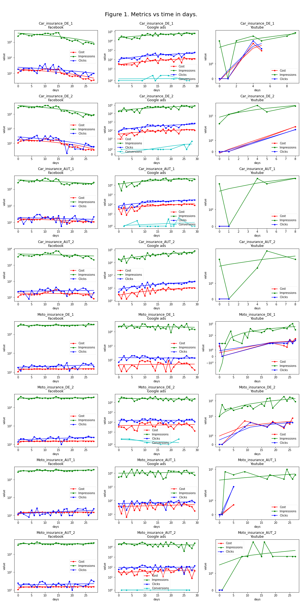
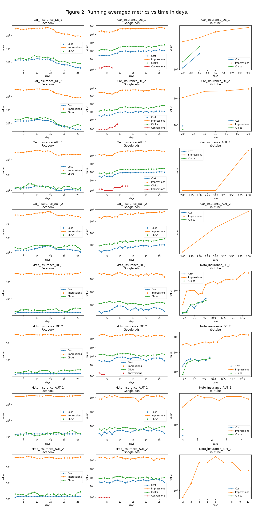
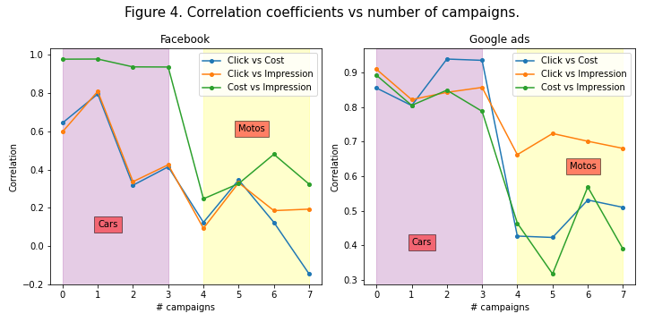
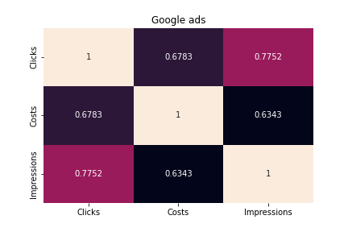
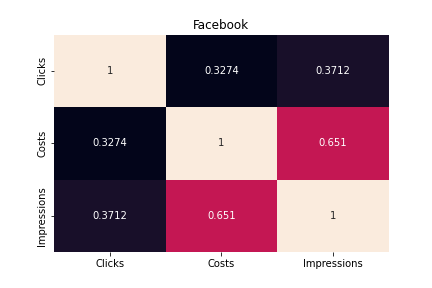
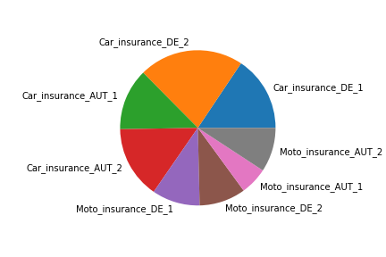

Analyze the date and give responses to the following questions:  
● How do the various metrics relate to one another?  (for instance, x spending = y clicks?)  
● Should marketing funds be spent primarily on one platform?  
● Do you have a recommendation for when to launch the new product?  
● Describe the effectiveness of the campaigns over the last few days?  
● Would it be possible to give a forecast for one of those campaigns?

#### Let's plot metrics vs time in days to have an idea about patterns between metrics. 
#### Additionally, a linear regression lines for each metric could hel understand the behavior of metrics.

#### Also, to have more insight we can plot running average of metrics vs time.

### Are there any patterns between the different metrics he is tracking? (e.g. x spending = y clicks? )

#### Judging by Figs. 1 and 2

1. Facebook: 
Just by judging the figures for **car insurances**, we can see a patterns (correlations) between **cost**, **impressions**, and **clicks** (particularly strong for car **cost** and **impressions**): the increment/decrease in one follows the other. It seems there is a correlation between clicks and cost for moto insurances too, but this could be confirmed by the evaluation of correlation coefficients. 

2. Google ads: 
Google ads, seems to outperform Facebook since stronger correlation can be seen between **cost**, **impressions** and **clicks** for car insurances. Also, **conversions** can be seen too for the first 3 car insurance campaigns which are absent for **Facebook** and **Youtube**. Moto insurances show correlation between **cost**, **impressions** and **clicks** as well but the **conversion** seems to be weakly correlated with other metrics. 

3. Youtube: 
There is no much data provided for **Youtube** compared to other providers, so it is hard to judge with less data. Nevertheless, figures show correlation between **cost** and **clicks** for 'Moto_insurance_DE_1' and 'Moto_insurance_DE_2' campaigns and for 'Moto_insurance_AUT_2', 'Car_insurance_AUT_2' and 'Car_insurance_AUT_1' campaigns only impressions are available, which means only brand awareness.

At this level of visualization, it seems that **Google ads** is the best provider, but let's evaluate the correlation coefficients.

#### Lets see the correlation coefficients for different campaigns and providers

### Are there any patterns between the different metrics he is tracking? (e.g. x spending = y clicks? ) (continued)

Now, we can compare better the correlation coefficients of the metrics. 

1. **Facebook**: Fig. 4 shows that the strongest correlation is between **Cost** and **Impression** for car and moto campaigns. It is also confirmed by averaged correlation matrices: the last entry in the second column is **Cost** vs **Impression** correlation coefficient. It also shows that the correlation between metrics is stronger for car campaigns (the points in the **Cars** region are higher than in **Motos** region).

2. **Google ads**: We can see again from Figure 4 that for cars the correlation is bigger than for motos and from averaged correlation matrices we get that the **Click** vs **Impression** is the biggest. 

3. **Youtube**: it is hard to give good answer for Youtube since we cannot rely much on correlation matrices because of fewer data points as compared to Facebook and Google ads. But, at least, we can see from the first figure a strong correlation between **Cost** and **Click**.

#### Let's also see average values of the correlations for different providers

#### The image below can help understand which provider gives average faster growth in metrics. 

#### It plots the slope coefficients averaged over metrics and campaigns for different providers

### On which platform should he invest most of his marketing spending?

I would suggest Google ads, because of the following reasons: 

1. It is the only platform that shows **Conversion**. 
2. It shows the fastest growth in metrics as shown in the above figure.
3. It shows the biggest values for the correlation coefficents averaged over all campaigns. In other words, there patterns are clear for Google ads.
4. **Click** vs **Impression** correlation is the biggest of all metric correlations for Google ads. 
5. It showed increase in the metric values over the days for car campaigns (see the Figure 1). For **Facebook**, the growth is slower and hence **Google ads** is preferrable. The increase of metrics is observable for **Youtube** too, but with fewer data points. Also, for **Youtube**, only 'Moto_insurance_DE_1' and 'Moto_insurance_DE_2' campaigns showed correlated increase in **Clicks**, **Impressions** and **Cost**, while for **Google ads** it can be seen for all **car** campaigns plus **Conversions** are available.

### Is there a best day of the week to launch the new product?

As we see, the best days to run a new campaign are:

1. Facebook --> **Tuesday**,
2. Google ads --> **Saturday**
3. Youtube --> **Friday**

But, since the best provider is **Google ads** the best day overall could be **Saturday**. Nevertheless, if we think about the brand awareness, so we might as well choose **Monday** to better advertise the products.

### How has the performance of his campaigns developed over the past few months?

Perhaps, the question is about days, because we have data for only a month. 

1. **Google ads** 

Over the last days, the best performace has been for **car** campaigns, since we clearly see the increase of **Impressions** and **Clicks** with augmented **Cost** and that the number of **Clicks** has increased with **Impressions** as seen from **Figs.** **1** and **2**. It cannot be said that **moto** campaigns develpoed positively since there is no clear increase in metric. Nevertheless, the metrics doesn't seem to decrease either for **Moto** campaigns. Additionally, there has been **Conversions**. 

2. **Facebook** 

The campaigns hasn't developed positively since for **car**s there is a decrease in metric values and no clear positive increase for **moto** campaigns. 

3. **Youtube** 

Although, an increase in metrics can be seen for **car** campaigns there is too few data points to give it a significanse level as high as for **Google ads**. Also, **cost**, **clicks** and **Impressions** increase for 'Moto_insurance_DE_1' and 'Moto_insurance_DE_2' but not for all days - for the second half of the campagns only increased **Impressions** are available.

### 'Can we give him a forecast for one of those campaigns?

To answer this question, I suggest to find the RMSE for each metric, calculate the average of it over metrics, and then find the campaign with maximum averaged RMSE. Let's proceed.

As we can see, the smallest RMSE is for *Moto_insurance_AUT_1*, so a forecase can be given to this campaign. If we select, **Google ads** below are the slope coefficients of the metrics for that *Moto_insurance_AUT_1*.

**Cost**: 0.4863701840903012 

**Impressions**: 56.64669836420121 

**Clicks**: 0.7284024785869994 

This means, that the **Impressions** would increase by 57 per day and there would be on average 0.72 more clicks per day for that campaign.